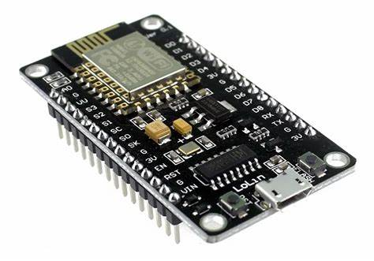

# Wi-Fi Jamming using Node MCU (ESP8266)

## Overview
This repository demonstrates how to use a Node MCU (ESP8266) for Wi-Fi jamming. The project showcases the effects of wireless interference on various devices and explores mitigation techniques.

⚠️ **Disclaimer**  
Wi-Fi jamming is **illegal in many jurisdictions** and can disrupt essential services. This project is intended **for educational purposes only** and should only be conducted in controlled environments with proper authorization.

---

## Features
- Uses ESP8266 to emit deauthentication signals, disrupting Wi-Fi connections.
- Demonstrates the impact of jamming on smartphones, laptops, and IoT devices.
- Provides strategies to mitigate interference.

---

## Requirements

### Hardware
- Node MCU (ESP8266)
- USB cable
- (Optional) External antenna for enhanced signal strength

### Software
1. **Arduino IDE**: Download from [arduino.cc](https://www.arduino.cc/en/software).
2. **ESP8266 Libraries**: Install through Arduino IDE’s Library Manager.

---

## Setup Instructions

### 1. Clone Repository and Flash the Code
1. Clone this repository to your local machine:
   ```bash
   git clone https://github.com/your-repo-name/esp8266-wifi-jammer.git
   cd esp8266-wifi-jammer
## Flashing the Code to Node MCU

### 1. Open the Code
- Open the provided Wi-Fi jamming code in Arduino IDE.

### 2. Customize the Code
- Modify the parameters as needed:
  - **CHANNEL**: Set the Wi-Fi channel to target (1–14).
  - **JAMMING_DURATION**: Specify the duration of jamming in seconds.

### 3. Configure Arduino IDE
- In Arduino IDE, go to **Tools** and select:
  - **Board**: `NodeMCU 1.0 (ESP-12E Module)`
  - **Port**: Select the COM port where the Node MCU is connected.

### 4. Upload the Code
- Click **Upload** to flash the code to the Node MCU.

---

## Execution

### 1. Run the Program
- Power the Node MCU, and it will start emitting jamming signals to disrupt nearby Wi-Fi networks.

### 2. Observe the Effects
- Devices within range will experience connectivity issues:
  - **Smartphones**: Loss of Wi-Fi, slow speeds, or dropped calls.
  - **Laptops/PCs**: Interrupted internet access or connectivity.
  - **IoT Devices**: Loss of communication and functionality.

---

## Observing Effects

| **Device**       | **Effect**                                       |
|-------------------|-------------------------------------------------|
| **Smartphones**   | Dropped Wi-Fi, slow speeds, lost calls          |
| **Laptops/PCs**   | Interrupted connectivity, internet disconnections |
| **IoT Devices**   | Loss of functionality, inability to connect     |

---

## Mitigation Techniques

- **Strong Signal**: Use high-gain antennas and position routers strategically.
- **Frequency Hopping**: Deploy networks using FHSS (Frequency Hopping Spread Spectrum) technology.
- **Enhanced Security**: Use robust encryption (e.g., WPA3) and strong passwords.

---

## Ethical Considerations

⚠️ **Important**  
- **Unauthorized Wi-Fi jamming is illegal** and can lead to severe consequences.
- Perform this project only in **controlled environments** with proper permissions.
- Avoid disrupting public or critical services.

---

## License

This project is licensed under the MIT License. See the `LICENSE` file for details.

---

## Contributors

- [Sandesh Basnet](https://github.com/Sandesh-Basnet)
- [Aayan K.C](https://github.com/aayankc0210)
- [Aaditya Roila](https://github.com/ROILAsir5)
- [Ronak Kunwar](https://github.com/RBR-Ronak)

---

## Questions?

Feel free to open an issue or contact the contributors via this repository.
